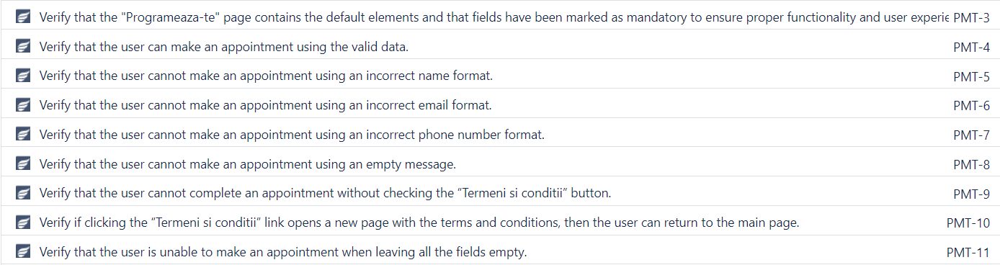
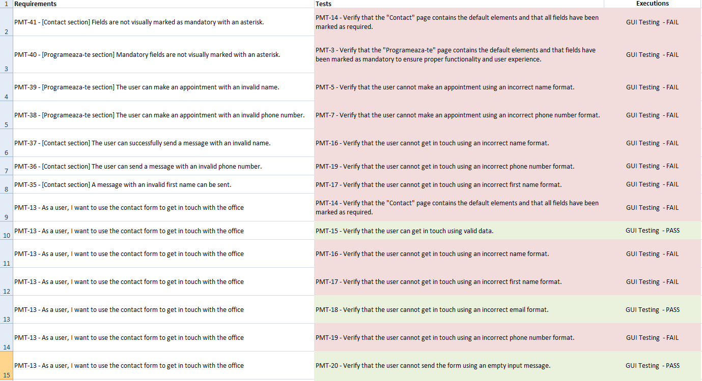
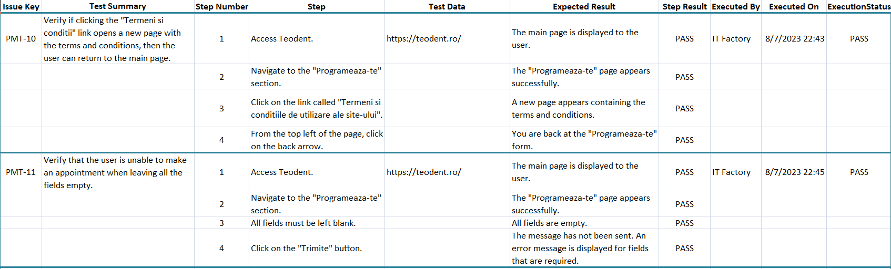
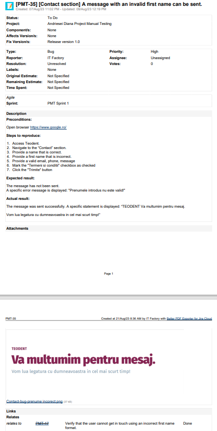
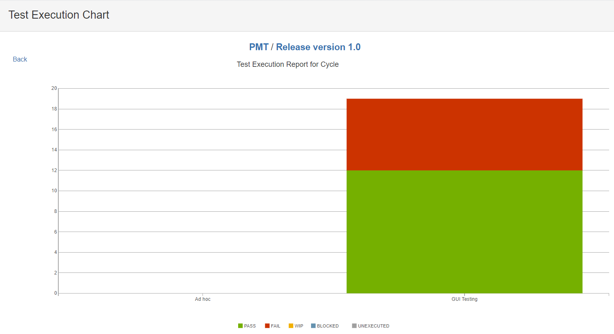
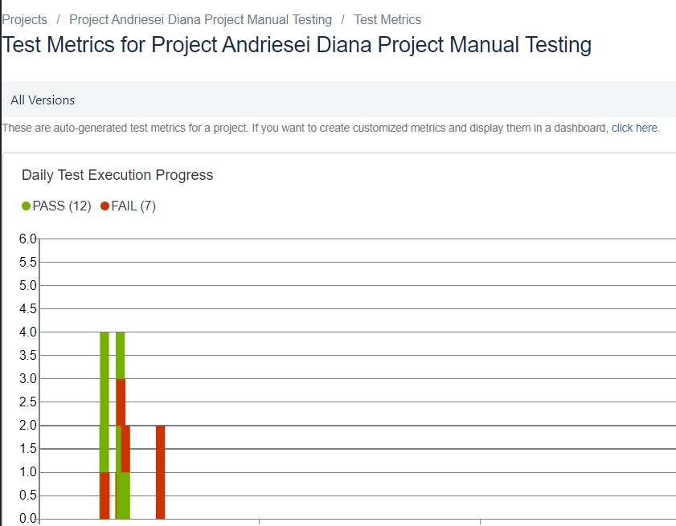

## Practical-Manual-Testing-Project

### Revision history:

| Date      | Description | Author    | Comments    |
| :-----------: | :-----------: | :-----------: | :-----------: |
| 7/06/2023      | Version 1.0       |  Andriesei Diana  | Draft    |

## 1. Introduction

The purpose of this plan is to provide an understanding of the testing method used on the https://teodent.ro/ website, with special attention to the “Contact” and “Programeaza-te” sections. To guarantee an end-to-end flow for the office appointment scheduling and clinic contact processes, the test scope includes GUI and functional testing techniques.

### 1.1 Test Objectives

*	The objective of this project is to apply the knowledge and skills acquired in a real-world testing experience.
* The purpose of this project is to gain real-life experience by implementing a real application and demonstrating the ability to apply theoretical knowledge.
* Verify the functionality and ease of use of the website https://teodent.ro/, particularly the “Programeaza-te” and “Contact” sections.
* The objective is to ensure a seamless end-to-end flow for scheduling an appointment at the clinic and contacting the clinic.
* Identify and report any issues or defects encountered during testing.

### 1.2 Functionalities in Scope

* Successfully obtaining a booking by successfully completing the appointment form.
* The possibility to get in touch with the office by using the contact form.

### 1.3 Functionalities Out of Scope

* Non-functional testing encompasses performance, security, and compatibility testing.
* Testing on specific hardware configurations or devices.
* Testing functionalities that refer to other types of products.
* To date, there is no solution that provides assistance in testing the quality of mobile applications.
* Automated testing.

## 2. Test Process
### 2.1 Test Planning

Identification of roles and responsibilities:

|  Software Developer    |  Andrei Andrei     |
| ----------- | ----------- |
| Product Owner   |  Cosmin Ionescu       |
| Project Manager   |  Luca Alexandru      |
|  QA Engineer    |  Diana Andriesei    |
|  Senior QA Engineer   | Vasilica Onuta   |

**Entry Criteria**:

Before testing begins, the following entry requirements must be met:

* Requirements documentation should be accessible for consultation.
* Roles and responsibilities have been defined.
* The test plan has been completed.
* Initial project risks were identified and mitigated.

**Exit Criteria**:

To consider the testing process complete, the following exit requirements must be met:

* All scheduled test cases have been completed.
* Issues and defects were identified, documented, tracked, and resolved.
* Created and reviewed test reports and documentation.
* The test objectives set by the project stakeholders were met.
* The deadline has been reached.

### Risks:

During the test project, the following potential threats were identified:

**Project Risks**:
* Resource Constraints: Lack of skilled resources such as developers, testers, or subject matter experts could have a negative impact on project progress and quality.
* Scope limitation: Frequent changes to project scope without proper assessment and impact analysis could disrupt project timelines, resources, and deliverables.
* Communication issues: Lack of communication and coordination between project stakeholders, including testers, the development team, and company representatives, can lead to misunderstandings, misalignment, and delays in decision-making.
* Budget overruns: The budget allocated for the project can go over budget if costs are estimated incorrectly, there are unforeseen expenses, or insufficient resources are allocated.
  
**Product Risks**: 
* Incomplete or Inaccurate Content: Content on the Website may contain inaccuracies, incomplete details, or outdated content, which may negatively impact the overall user experience.
* Compatibility Issues: The Website may have compatibility issues with some major web browsers, operating systems, or devices. This may cause usability issues for some users.
* Security Vulnerability: Some app vulnerabilities can expose user data, compromising the security and trust of the platform.
* Performance issues: The website may experience delays in processing user actions, page loading delays, or inadequate performance under high user traffic conditions.
* Functional Deficiencies: There is a possibility that the implemented functionalities may not meet the expected requirements, which may make the user unhappy or have a bad experience.

### 2.2. Test Analysis

* Assess business requirements and acceptance standards for relevant functionality.
* Defines the test method, test categories, and techniques used.
* Describe the conditions that will be tested during the testing process.
* The testing method is functional testing of the UI (Graphic User Interface): which is related to evaluating the functionality and behavior of an application. These tests examine whether the functions, buttons, input fields and other elements of the interface work correctly and give the user the results he expects.

### Techniques used for GUI (Graphical user interface) testing include:

* Positive testing: check that the fields are completed correctly according to the requirements
* Negative testing: check that fields cannot be filled with incorrect or invalid information
* Boundary value analysis testing: check that the fields can accept the minimum and maximum values allowed.
* Equivalent Partitioning Testing: this method involves dividing the input data into groups or partitions so that the important representatives in each group are tested.

### Test Conditions for "Programeaza-te" and "Contact" Categories:

Test conditions for the "Programeaza-te" and “Contact” category will be defined for the following functionalities: 

1. Evaluation of Displaying the Correct Interface - This condition focuses on ensuring a smooth user experience by displaying the interface properly.
2. Verification of Required Field Marking - It is essential to ensure that all required parts of the form are properly marked to indicate that they are required.
3. Recording of Programming with Correct Information - This condition checks if the schedule was successfully registered when the user enters all the data in the appropriate fields.
4. Non-Recording of Programming with Incorrect Information - When the user enters incorrect or invalid data in the fields, we will check that the appointment is not recorded.
5. Functionality of the "Termeni si conditii" Link - This condition requires verification that after clicking on the “Termeni si conditii” link, you have successfully opened a new page containing the terms and conditions. It should be easy for the user to return to the main page.
6. Testing of the "Trimite" Button - This condition focuses on ensuring that the “Trimite” button works correctly and performs the intended functionality.

### 2.3. Test Design

* The purpose of the Zephyr Squad tool is to facilitate the creation of working test cases. Positive testing, negative testing, and use case testing are test design techniques used to create test cases based on specification analysis.
* Test scenarios and test cases will be established according to the identified acceptance criteria.
* For each test case, the required data and expected results will be established.
* Test cases will be prioritized based on risk and importance.

### 2.4. Test Implementation

Before starting the test execution phase, the following must be prepared:
* The test environment is up and running: https://teodent.ro/
* A cycle summary has been created called “GUI Testing”.
* The cycle summary will include the test cases that will be created.
* The application should be up and running and available for testing.
* The necessary test data and environment must be configured.
* Testing tools and resources should be prepared and available for use.
* We will prepare the test data that is required to run the test cases.

### 2.5. Test Execution

* The test cases will be executed according to the test cycle summary that will be  created.
* Errors will be identified based on the tests that will be performed. The full bug report will be available based on identified errors.
* Execute the test cases according to the test plan and schedule.
* Observe actual and expected results.
* Record any problems or issues that arise during testing.
* To ensure that the defects were successfully resolved, we performed additional tests.

  
### 2.6. Test Closure

* Test closure reports should include test activities, results, and suggestions.
* Exit criteria will be evaluated
* Test completion reports will be generated and sent to the stakeholders
* Residual defects will be closed and testing materials will be archived

### 2.7. Test Monitoring and Control

This will be done by generating periodic test status reports that will reflect the testing progress and will signal any new project risks that will be identified in order to be mitigated.

## 3. Test Deliverables

* [Test Plan](TestingDocumentation/TestPlan)
* Test Conditions

  
  
* [Test Cases](TestingDocumentation/CycleSummaryTeodent)
* Daily Test Summary Reports
* [Traceability Matrix](TestingDocumentation/MatriceaTrasabilitatii)

  
  
* Test Case Results

  
  
* [Bug Reports](TestingDocumentation/RaportDeBug-uri)

   

   -------------------

       

I used Jira to generate a test execution report focused on the "GUI Testing" cycle. Of the 19 tests performed, 7 failed.
We recommend a careful and focused approach to these failures, including the following aspects: identifying the underlying causes for each failure, determining the impact of each failure on the user experience, and taking the necessary measures for the prompt correction of the identified problems.
Our goal is to improve quality and provide an improved experience to our users.

